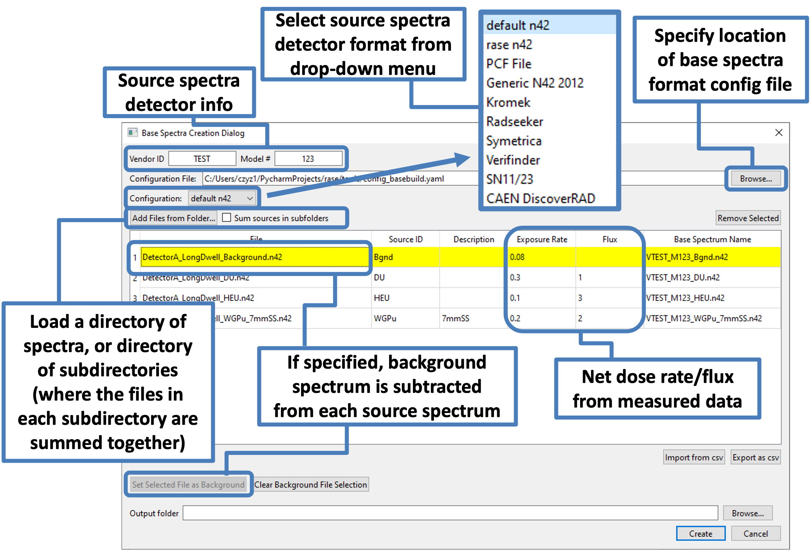

.. _base_spectra_creation_tool:

**************************
Base Spectra Creation Tool
**************************

+++++++++++++++
Basic Operation
+++++++++++++++

A *Base Spectra Creation Tool* was introduced in RASE to help develop new base spectra from data acquired with an instrument. This page provides some details on how to use this tool.  For an overview of the process and information about what data are necessary for generating base spectra, see :ref:`create_base_spectra`

The Base Spectra Creation dialog can be accessed from the main RASE menu by selecting *Tools >> Base Spectra Creation*.

At the top of the dialog, enter the four-character manufacturer abbreviation and the three-character alphanumeric model number abbreviation for the instrument for which base spectra are being produced.

The next step is to choose a configuration for reading the input files from the drop-down box. The "default" configuration is designed to read N42 (2012) files that do not contain any vendor-specific formatting idiosyncracies.
PCF files [PCF]_ produced by GADRAS can also be used by selecting the corresponding format.
Other configurations can be specified by using the *Configuration File* selection to load a YAML file containing information about different detector models and their use of the N42 format.
See below for assistance in writing your own configuration file.

The *Add Files from Folder...* button allows the user to select a directory from which to import the long-dwell measurements that have been collected and will be used for generating the base spectra. All spectra files within the selected folder will be imported. The files will appear in the table at the center of the dialog window. For PCF files, each entry in the table corresponds to a spectrum in the file. The button can be used multiple times to add files from multiple directories. Note that while only the filename is shown in the first column, the data folder name is also recorded and is shown in a tooltip when hovering the mouse on each filename.

Once the files are loaded in the table additional information must be provided. The table cells in the columns *Source ID*, *Description*,  *Exposure Rate*, and/or *Flux* must be entered in correspondence to each listed file. The *Description* label is optional and is used to describe the shielding scenario or other relevant measurement conditions, or to distinguish between similar sources (e.g. different types of "NORM" sources). Examples of *Description* labels are "5mmSteel" or "KittyLitter" or "70mmPMMA". Finally the measured net dose rate, in μSv/h should be entered in the *Exposure Rate* column. Currently the software assumes that this dose is for the source-only term i.e. the dose rate for the background has been already subtracted. For the background file, enter the measured background dose rate.

The tools provides capabilities to import and export the main table as a CSV for convenient editing in an external spreadsheet software.

Since the instrument measurements inevitably include the background contribution to the measured spectra, the user must tell the software which of the loaded files should be used to perform the background subtraction. This can be done by selecting the appropriate row in the table and then clicking the *Set Selected File as Background* button. The selected row will be highlighted to indicate the selection.

Once all the information is entered, the software is ready to create RASE-compatible base spectra when the user press the *Create* button. The software will create the base spectra in the folder specified in the *Output Folder* field. Each base spectrum will have the automatically-generated filename indicated in the *Base Spectrum Name* column in the table. These files can then be loaded in RASE for further use as described in :ref:`workflowStep1`.

++++++++++++++++++
Advanced Operation
++++++++++++++++++

Some instruments use unusual methods of record their raw data. This may require the use of advanced settings.

The *Sum sources in subfolders* checkbox is used when a instrument is unable to record the long measurements required for
a base spectrum in a single n42 file. This checkbox modifies the behavior of the *Add Files from Folder...* button. With the checkbox selected, you can
use the *Add Files from Folder...* to select a directory containing subdirectories which themselves contain n42 files.
Each subdirectory will be turned into a single base spectrum by summing the files in each subdirectory.

Using a configuration file, most idiosyncrasies in N42 formatting can be accommodated. A configuration file should be a YAML file. Each
top block should name a particular configuration, e.g. one detector make or model. Each of these top blocks should specify the following fields:

* `measurement_spectrum_xpath`: This field describes, in the XML XPATH format, the location of the measurement, i.e. the source. In the N42 format, this is a `Spectrum` block, which must contain a `ChannelData` child.

* `realtime_xpath`: This field is an XPATH pointing to the corresponding real time for the measurement.

* `livetime_xpath`: This field is an XPATH pointing to the corresponding live time for the measurement.

An XPATH may point to one or more blocks within an XML file. For all of the above fields, if more than one block is returned from the XPATH query, the contained spectra or times
are summed. This feature can be used to produce a single sum spectra from the many measurements contained in the output of a dynamic detector.

* `calibration`: This field may be an XPATH pointing to a block in the XML containing a `CoefficientValues` child. Alternatively, it may be a string containing the calibration coefficients directly. This second mode is useful when the detector specifies its calibration in some form other than calibration coefficients, such as bin-by-bin calibration values.
* `additionals`: This should be a YAML list of any blocks that should be copied from the input to output (base) files. Typically, secondary spectra should be copied over to make them available to RASE. Other XML blocks can be copied for the user's convenience. These blocks will be copied over exactly from the source file.

For any of the above fields, the user is advised to make use of the features of the XPATH format to select the correct measurement, etc. from the files. For example,
`./RadMeasurement[@id="ForegroundMeasureSum"]/Spectrum` will correctly find the spectrum identified by the "ForegroundMeasureSum" attribute.

|

    **“Base Spectra Creation Tool” dialog.**
