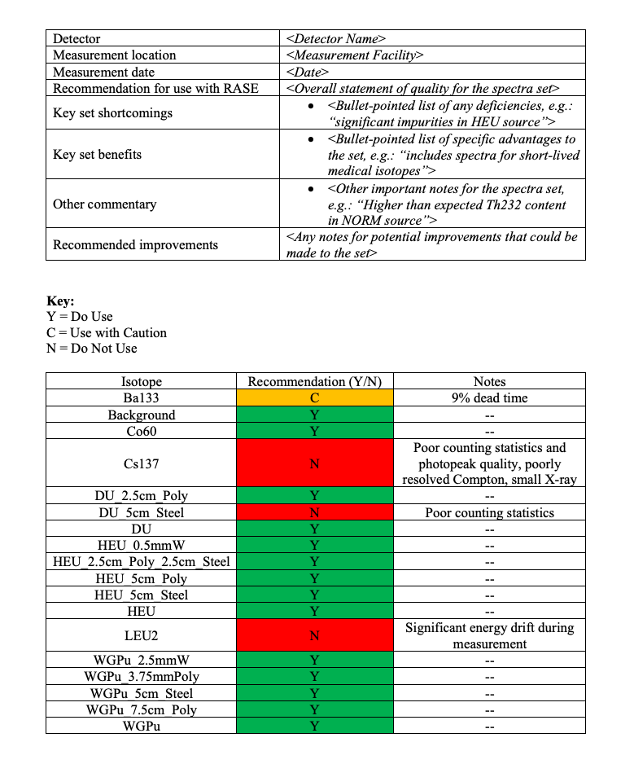

.. _create_base_spectra:

***************************************
How to create new base spectra for RASE
***************************************

Four steps are required to produce a new base spectrum for a given instrument for use within RASE:

#. Obtain high statistics measurement of the source and background spectra at a known dose rate/photopeak flux.
#. Process the measured spectra to extract the source term
#. Calculate the ``rase_sensitivity`` and/or the ``flux_sensitivity`` factors
#. Produce properly-formatted n42 base spectra file for ingestion in RASE

The :ref:`base_spectra_creation_tool` in RASE can be used to help and automate the analysis in steps 2-4, although the
analysis can also be performed manually following the instructions below.

For additional details, refer to [RASE_standard]_

Collecting high-statistics source spectra
=========================================

Required Equipment
------------------

The following equipment is required for collecting base spectra:

- Radioactive source of interest
- Rad/nuc instrument of interest a.k.a. System Under Test (SUT)
- Ground truth instruments:

    - Calibrated HPGe spectrometer (for expressing RASE base spectra in units of flux)
    - Calibrated Exposure rate measurement e.g. Fluke 451P ionization chamber (for expressing RASE base spectra in units of dose)

- Measuring tape
- Means to transfer collected data from the SUT(s) and ground truth detectors to a computer for analysis

Required Metadata
-----------------

At a minimum, the information listed below must be recorded for each spectrum acquired.

- Instrument name and model for the SUT and for all ground truth instruments
- Details of the radioactive source(s)

    - Material name (e.g. HEU, WGPu, or nuclide name)
    - Source activity and/or mass
    - Any shielding for the source (material and thickness)

- Dwell time
- Position of the source, with relevant units, with respect to the SUT and the ground truth instrument(s). Position is recorded in (x, y, z) from the center of the detector face (from the perspective of the detector, facing directly towards the source), where x = right-to-left, y = standoff, z = up-and-down. Note that if the detector is rotated, the x, y, and z coordinates should be adjusted to account for this rotation.

    - e.g.: If the source is located at a standoff of 100 cm along the centerline of the detector, the (x, y, z) position (in cm) would be (0, 100, 0). If the source was shifted 50 cm to the right from the perspective of the detector, the (x, y, z) position would be (50, 100, 0). If the detector was rotated 90 degrees clockwise about the center of the detector face and parallel to the floor, the (x, y, z) position would be (-100, 50, 0). If the detector was then, in this configuration, lowered by 25 cm towards the floor, the (x, y, z) position would be (-100, 50, 25). Note in this case that the z coordinate is positive because the source is now offset 25 cm above the center of the face of the detector.
    - Note that if multiple SUTs and the ground truth instruments are all facing the source such that the source lies on the centerline of each detector, they will all have an x and z coordinate of 0.

- Dose rate of the background acquired with the calibrated ground truth instrument immediately prior to the measuring of a source.

Though not strictly necessary for base spectra building and not included in the files themselves, the user should also record:

- Date/time of acquisition
- Height of the source and the detector from the ground, and any relevant environmental features
- Any characteristics qualities about the source and/or the measurement conditions that may result in unexpected spectral features (e.g.: distributed source, non-homogenous composition, self-shielding, significant quantity of impurities, etc.)

It is good practice to create a summary file for any created base spectra set for a given instrument, which should be included whenever the base spectra set is distributed. An example of such a summary file can be seen below.

    An example of a summary file created when the base spectra were acquired/processed which a user might include when sharing the base spectra set.

Data Collection
---------------

Adherence to the following procedure and recommendations will result in high-quality base spectra:

#. Establish well-controlled laboratory conditions to perform the measurement.
#. Record all metadata indicated in the above section.
#. Acquire a high-statistics, long-dwell (at least 1 hour) background spectrum, acquired under the same experimental conditions as for the source measurements. Carefully measure and record the dose rate with a calibrated ground truth instrument (usually an ionization chamber). This background is used to create the background base spectrum, and is subtracted from all source spectra during analysis.
#. If the detector has an internal calibration source, every effort should be made to determine the independent contribution of the internal source. RASE accounts for this contribution independently, and as such the spectroscopic contribution of the internal source should be uniquely determined (i.e.: without background).
#. Measure and record a background dose rate with the ground truth instrument(s) immediately prior to the first source measurement and between all subsequent source measurements. Each background dose rate measurement should be taken long enough to have a stable estimate of background prior to the measurement with a source; excepting cases of extreme background fluctuations, these measurements should be conducted for ~5 minutes.
#. Set up the measurement scenario (source strength, source-instrument distance, shielding) such as to ensure that a significant fraction of the count rate in the instrument arises from the source term alone.

    - Verify that no significant pile-up or dead time is present in the instrument under the scenario configuration. Ideally dead time should be limited to no more than 2%. Spectra with times in excess of 20% should not be used with RASE.
    - The instrument’s orientation with respect to the source should be the same as how it is intended to be used in the field.
    - Standoff should be such that geometric effects are insignificant. Excepting extreme cases, this usually involves a standoff of ~30x the radius of the source material distribution.

#. Record at least one of the following:

    - Total dose rate from the source + background as recorded by a calibrated ground truth instrument. This is necessary if the user plans to use RASE to scale the source by dose. If possible, the dose rate from the source should be at least 5 times above background.
    - Photopeak flux as recorded by a calibrated ground truth instrument. This is necessary if the user plans to use RASE scale the source by photopeak flux. The net counts in the photopeak of interest for the ground truth instrument should be at least 10,000, which ensures 1% precision.

#. Record a raw source spectrum with the SUT. Collect sufficient statistics so that the relevant source peaks are known to high confidence. Acquisition times for raw spectra should be adjusted such that the base spectra they are processed into contain at least ten times the number of counts contained in any individual sample spectrum expected to be generated from them. This should be done according to the formula: :math:`R_0 \cdot T_0 > 10 \cdot R_S \cdot T_s` where :math:`R_0` is the dose rate/photopeak flux produced by the base material at the distance at which the raw spectrum was collected, :math:`T_0`	is the live time of the raw spectrum collection, :math:`R_s` is the maximum dose rate/photopeak flux to be simulated in the sample spectra, and :math:`T_S` is the maximum live time to be simulated in the sample spectra.

If measured spectra cannot be obtained, simulated spectra can also be used with RASE. These spectra should demonstrate the same qualities as noted above.

Process measured spectra
========================

In order to allow for generation of varying scenarios with different sources and dose rates, RASE needs base spectra that reproduce the instrument response to the radiation arising from the source term alone. For this reason, when creating a set of base spectra the background and any spurious component (e.g. intrinsic calibration source) must be subtracted from each long-dwell source measurement. Removing the background contribution to a source spectrum can be done manually, as described here, or automatically, using the base spectra creation tool (see :ref:`base_spectra_creation_tool`).

The background-subtracted source spectrum can be obtained manually through channel-by-channel subtraction of the long-dwell background spectrum from the raw source spectrum. Before doing the subtraction the background spectrum should be normalized by live time and be scaled by the relative dose rates of the long-dwell background and the background dose rate acquired immediately prior to the source measurement. Re-binning should be performed if needed to account for any gain shift between source and background spectra. If an intrinsic calibration source is visible in the measured source spectrum, it should be also subtracted after normalizing by live time. When generating base spectra of natural radiation background, background subtraction should not be performed, but the contribution of the intrinsic calibration source should be subtracted.

*NOTE*: In some cases, it may not be possible to subtract the intrinsic calibration source spectrum from the background appropriately (e.g.: the internal source spectrum has a background contribution in it, making it impossible to correctly subtract from the natural radiation background spectrum acquired by the user). In this instance the background spectrum should be left as-is with the note that it should not be scaled by dose when conducting RASE simulations (as this would artificially increase/decrease the strength of the internal calibration source). When loading base spectra with a background made this way into RASE during the detector creation step of the RASE workflow (see :ref:`workflowStep1`), the secondary spectrum should be marked as a "secondary background" as opposed to an "internal source" to prevent RASE from adding the internal source contribution twice (once for the background described in the scenario that still contains the internal source spectrum contribution, once for the internal source background).

Photopeaks for specifying flux
------------------------------

For RASE to scale a spectrum based on flux, the flux specified in a scenario must be associated with the same photopeak as the ground truth flux value recorded when the base spectrum is created. The table below specifies which peaks should be used to determine flux values for various isotopes. If the isotope is not recorded in the table below, note the photopeak used in the test records/summary file and contact the RASE support team at RASE-support@llnl.gov to have the value added to the table. The user is also free to add a ``<remark>*user text*</remark>`` xml tag within any section (e.g.: the spectrum section below the ``<FLUX_Sensitivity></FLUX_Sensitivity>`` tags) to note the information, without having any effect on RASE operation.

+-----------------+---------------------+
|   **Nuclide**   | **Photopeak (keV)** |
+-----------------+---------------------+
| Am241           | 59                  |
+-----------------+---------------------+
| Ba133           | 356                 |
+-----------------+---------------------+
| Bi207           | 570                 |
+-----------------+---------------------+
| Co57            | 122                 |
+-----------------+---------------------+
| Co60            | 1173                |
+-----------------+---------------------+
| Cs137           | 662                 |
+-----------------+---------------------+
| Eu152           | 245                 |
+-----------------+---------------------+
| Ga67            | 185                 |
+-----------------+---------------------+
| I131            | 364                 |
+-----------------+---------------------+
| K40             | 1461                |
+-----------------+---------------------+
| Na22            | 1275                |
+-----------------+---------------------+
| Np237           | 312                 |
+-----------------+---------------------+
| Ra226           | 352                 |
+-----------------+---------------------+
| Tc99m           | 141                 |
+-----------------+---------------------+
| Th232           | 2615                |
+-----------------+---------------------+
| Tl201           | 167                 |
+-----------------+---------------------+
| U232            | 583                 |
+-----------------+---------------------+
| U233            | 440                 |
+-----------------+---------------------+
| U235/HEU        | 186                 |
+-----------------+---------------------+
| U238/DU         | 1001                |
+-----------------+---------------------+
| Pu239/WGPu      | 414                 |
+-----------------+---------------------+

.. _compute_rase_sensitivity_factor:

Compute ``rase_sensitivity/flux_sensitivity`` factor
====================================================

The RASE sensitivity factor :math:`S_{\text{RASE}}` encodes all information necessary to properly scale the base spectra for different source dose rates and acquisition times. It is computed according to the following equation:

.. math::

   S_{\text{RASE}} = \frac{\text{net count rate [cps]}}{\text{gamma dose equivalent rate }[\mu\text{Sv/h]}}

The net count rate is obtained by integrating the background-subtracted spectrum acquired with the SUT and dividing it by the measurement live time. The gamma dose equivalent rate comes from the value obtained during measurement with the ground truth calibrated ionization chamber, again after the dose equivalent rate for background has been subtracted.

The flux sensitivity factor :math:`S_{\text{FLUX}}` fulfills the same role as the RASE sensitivity factor for measurements recorded in units of flux instead of dose. It is computed according to the following equation:

.. math::

   S_{\text{FLUX}} = \frac{\text{net count rate [cps]}}{\text{photopeak flux}[\gamma\text{/cm}^2s]}

The net count rate is obtained in the same manner as above: integrating the entire background-subtracted spectrum acquired with the SUT and dividing by the measurement live time. The photopeak flux is the net photopeak flux at the face of the SUT, which can be calculated from the photopeak count rate taken from the ground truth detector measurement. Note that the user must account for the photopeak detection efficiency and adjust for differences in standoff between the SUT and the ground truth detector using the :math:`\frac{1}{r^2}` law.

These factors are calculated manually by the user if base spectra are being created by hand, and are automatically calculated and included in the base spectra based on user input when using the base spectra creation tool (see :ref:`base_spectra_creation_tool`).

IMPORTANT NOTES:

* The user can provide either an exposure rate, or a flux, or both. If neither factor is included in a base spectrum file it will not be possible to load it into RASE. If using the base spectra creation tool and neither exposure rate or photopeak flux is specified, the spectrum defaults to RASE sensitivity factor of 1 while the flux sensitivity factor is not defined.

* Background spectra are always given in units of dose.

* When creating base spectra for the background (using the long-dwell background), use the raw spectrum and the actual dose rates to calculate the RASE Sensitivity factor.

.. _base_spectra_naming_convention:

Base spectra file naming convention
===================================

The file name for the base spectra follows the format ``Vvvvv_Mmmm_Source_Description.n42`` consists of four fields (vendor’s abbreviation, instrument model abbreviation, source name and scenario description) each separated by an underscore character:

* Vvvvv = a four-character manufacturer abbreviation
*	Mmmm = a three -character alphanumeric model number abbreviation
*	Source = a label describing the source
* Description = a label describing the shielding scenario or other relevant measurement conditions

The source description label shall follow a defined naming convention:

.. table::
    :widths: 550 300 800

    +---------------------------------------+-----------------------------+---------------------------------------------------------------------------------------------------------------------------------------------------------------------------------------------------------------------------------------------------------------------+
    | **Nuclide or aggregate**              | **Source label**            | **Comments**                                                                                                                                                                                                                                                        |
    +=======================================+=============================+=====================================================================================================================================================================================================================================================================+
    | 235U                                  | HEU                         | Highly enriched uranium with 235U/U above or equal to 20 %                                                                                                                                                                                                          |
    +---------------------------------------+-----------------------------+---------------------------------------------------------------------------------------------------------------------------------------------------------------------------------------------------------------------------------------------------------------------+
    | 235U+238U                             | LEU                         | Low enriched uranium with 235U/U between 0,7% and 20 %                                                                                                                                                                                                              |
    +---------------------------------------+-----------------------------+---------------------------------------------------------------------------------------------------------------------------------------------------------------------------------------------------------------------------------------------------------------------+
    | 238U                                  | DU                          | Depleted uranium with 235U/U below 0,7 %                                                                                                                                                                                                                            |
    +---------------------------------------+-----------------------------+---------------------------------------------------------------------------------------------------------------------------------------------------------------------------------------------------------------------------------------------------------------------+
    | 239Pu+240Pu+241Pu                     | WGPu                        | Weapons grade plutonium with 239Pu/Pu above or equal to 93 %                                                                                                                                                                                                        |
    +---------------------------------------+-----------------------------+---------------------------------------------------------------------------------------------------------------------------------------------------------------------------------------------------------------------------------------------------------------------+
    | 239Pu+240Pu+241Pu                     | RGPu                        | Reactor grade plutonium with 239Pu/Pu below 93 %                                                                                                                                                                                                                    |
    +---------------------------------------+-----------------------------+---------------------------------------------------------------------------------------------------------------------------------------------------------------------------------------------------------------------------------------------------------------------+
    | 40K                                   | Knorm                       | Potassium fertilizer or Potassium salt                                                                                                                                                                                                                              |
    +---------------------------------------+-----------------------------+---------------------------------------------------------------------------------------------------------------------------------------------------------------------------------------------------------------------------------------------------------------------+
    | 238U decay chain                      | Unorm                       | Uranium decay chain in equilibrium with daughters (e.g. a base spectrum of phosphate fertilizer)                                                                                                                                                                    |
    +---------------------------------------+-----------------------------+---------------------------------------------------------------------------------------------------------------------------------------------------------------------------------------------------------------------------------------------------------------------+
    | 232Th decay chain                     | Tnorm                       | Thorium decay chain in equilibrium with daughters (e.g. a base spectrum of welding rods, camera lenses or lantern mantles)                                                                                                                                          |
    +---------------------------------------+-----------------------------+---------------------------------------------------------------------------------------------------------------------------------------------------------------------------------------------------------------------------------------------------------------------+
    | Natural radiation background          | Bgnd                        | Contribution from non-naturally occurring radioactive material into the spectrum shall be negligible                                                                                                                                                                |
    +---------------------------------------+-----------------------------+---------------------------------------------------------------------------------------------------------------------------------------------------------------------------------------------------------------------------------------------------------------------+
    | nnnMM                                 | MMnnn                       | All other nuclides, MM is a 2-alphabetic placeholder for the nuclide name according to *ISO 80000-9:2009, Quantities and units – Part 9: Physical chemistry and molecular physics* and nnn is an up to 3-digits placeholder for nuclide atomic number, e.g. Cf252   |
    +---------------------------------------+-----------------------------+---------------------------------------------------------------------------------------------------------------------------------------------------------------------------------------------------------------------------------------------------------------------+
    | Other nuclides mixture                | Name1+Name2                 | Separate each source name with a ‘+’ sign. Individual names are based on the rules above                                                                                                                                                                            |
    +---------------------------------------+-----------------------------+---------------------------------------------------------------------------------------------------------------------------------------------------------------------------------------------------------------------------------------------------------------------+

For example, the name ``Vabcd_M123_Am241.n42`` would represent the spectrum of a 241-Am source for instrument ‘123’ manufactured by ‘abcd’.  Similarly, ``Vabcd_M123_Cs137_12mmSteel.n42`` would represent the spectrum of a 137-Cs source shielded behind 12 mm of steel.

Format n42 base spectrum file
=============================

The format of the base spectra is based on the ANSI N42.42 format.

The ``<N42InstrumentData>`` element is the parent element for all data in the file. It must contain one ``<Measurement>`` element, representing a measurement. The ``<Measurement>`` element contains various child elements that describe the instrument and the data collected.

Notes:

*   ``<remark>`` elements can be added to any section, and are ignored by RASE when reading in base spectra. This is useful for recording information that is not read in by RASE but provide insight into the data. For example, the user might add a remark indicating the original measurement location.
*	The element ``<RASE_Sensitivity>`` provides the gross sensitivity  in :math:`\frac{cps}{\mu Sv/h}` to the radionuclide whose abbreviation appears in the file name. Similarly, the element ``<FLUX_Sensitivity>`` provides the gross sensitivity  in :math:`\frac{cps}{\gamma/cm^2s}` in the characteristic photopeak to the radionuclide whose abbreviation appears in the file name.
*	All base spectra for a given instrument including background must have the same ``<calibration>`` element, i.e. be defined in the same energy scale.
*	If required by the identification algorithm, a secondary spectrum (e.g. a background spectrum or the spectrum of the internal calibration source) can be provided after the measurement spectrum as an additional ``<spectrum></spectrum>`` element.
*   For additional details, refer to IEC Standard, *Radiation instrumentation – semi-empirical method for performance evaluation of detection and radionuclide identification*, 2016

The following example of the XML data file is from a 2048-channel MCA. The indented formatting is purely for readability and is not required. Line breaks are not required, and there is no limit to line length. Spectrum compression according to the ANSI N42.42 is allowed.

.. code-block:: XML

  <?xml version="1.0" encoding="UTF-8"?>
  <N42InstrumentData>
    <Measurement>
        <Spectrum>
            <RealTime Unit="sec">110.0</RealTime>
            <LiveTime Unit="sec">109.92</LiveTime>
            <Calibration Type="Energy" EnergyUnits="keV">
                <Equation Model="Polynomial">
                    <Coefficients>0.0 1.59 0.0</Coefficients>
                </Equation>
            </Calibration>
            <Position Units="cm">
                <x>50</x>
                <y>100</y>
                <z>0</z>
            </Position>
            <ChannelData> 8 14 17 18 36 38 41 50 76 97 102 105 142 150 167 192
            163 203 194 204 213 218 205 258 218 269 258 276 265 311 277 311 335
            321 356 386 403 459 492 524 567 575 591 656 677 694 797 816 898 958
            919 1097 1026 1182 1169 1302 1374 1465 1501 1686 1615 1645 1599 1597
            1559 1605 1538 1584 1439 1453 1513 1456 1377 1322 1261 1290 1340
            1262 1383 1465 1471 1740 1985 2471 3223 4087 5105 6220 7288 8093
            8209 8085 7551 6536 5379 4119 3060 2260 1648 1230 875 671 541 406
            316 247 224 161 117 114 90 100 91 69 77 68 69 76 81 56 58 61 63 63
            46 81 58 55 65 60 57 62 63 75 52 57 49 43 64 41 63 42 49 45 52 42 44
            43 44 49 53 47 49 31 57 40 48 34 41 40 40 37 31 25 42 28 33 28 34 35
            36 30 33 21 21 28 32 30 29 29 20 17 44 36 37 30 22 29 20 22 26 25 19
            25 24 14 23 18 23 21 18 24 21 22 14 19 14 21 16 28 20 24 17 19 10 15
            20 10 19 19 13 13 20 9 28 26 18 11 8 14 8 12 13 10 10 19 10 9 11 20
            10 14 12 15 10 12 13 13 11 13 9 16 10 9 10 14 11 17 8 12 6 10 10 9
            10 8 16 10 11 10 9 7 8 13 8 8 9 12 7 9 11 5 7 11 7 8 8 9 8 7 7 6 12
            10 13 8 5 6 10 8 6 12 10 7 8 7 9 3 11 5 5 10 5 9 16 5 5 8 13 9 4 4 9
            8 6 7 3 4 4 7 7 4 9 8 7 4 3 9 7 8 7 3 8 0 5 5 2 4 5 6 8 11 2 5 4 3 3
            5 5 3 5 6 6 7 4 3 7 5 4 8 9 1 4 4 4 3 3 9 4 4 4 3 4 11 5 4 5 8 5 5 4
            3 4 3 4 4 4 4 5 6 2 6 3 1 4 3 9 3 1 6 8 6 5 2 5 3 5 7 3 3 2 6 3 6 2
            6 7 4 6 6 3 10 8 2 0 7 5 3 3 3 7 6 2 4 1 1 2 2 3 2 4 7 5 3 4 5 6 3 7
            2 3 4 5 1 5 8 1 2 2 0 4 2 1 0 2 7 2 5 3 0 2 1 3 4 2 4 4 6 7 4 4 3 4
            2 4 5 0 2 4 2 2 3 3 2 3 2 4 2 6 4 1 1 4 1 2 6 2 1 3 2 5 4 1 7 1 3 9
            1 2 2 6 4 1 3 1 6 2 3 2 1 4 2 2 4 3 1 3 4 0 2 3 1 3 1 2 3 6 2 1 1 2
            2 2 5 1 2 3 2 3 2 5 3 1 3 3 0 3 0 4 2 3 2 2 2 2 3 2 1 3 0 6 3 5 4 3
            1 3 4 6 2 4 1 3 1 2 3 3 1 4 4 1 4 2 1 4 2 3 1 2 0 2 1 1 3 2 2 2 2 3
            3 2 3 1 0 1 2 1 3 5 0 1 1 3 4 4 3 0 1 2 2 2 2 3 1 2 3 3 1 0 0 1 3 0
            2 1 1 1 1 0 4 3 0 1 0 0 0 0 1 0 0 2 1 2 2 0 1 2 0 0 3 1 2 2 2 3 0 1
            0 1 4 4 2 1 5 1 2 0 4 0 0 3 7 1 4 2 0 2 1 4 2 3 0 4 3 2 2 1 3 5 2 0
            1 3 2 0 1 2 0 6 1 1 4 2 1 1 1 3 0 0 0 1 2 3 1 1 2 2 1 2 0 1 1 1 3 2
            4 0 3 1 1 2 3 2 1 0 1 0 3 2 3 0 0 1 1 1 2 2 0 2 2 2 0 2 1 0 3 0 2 1
            0 2 2 2 0 0 0 0 3 1 2 1 0 2 0 2 1 1 1 1 1 2 3 0 0 1 0 1 0 2 1 0 0 1
            0 0 0 0 3 1 0 0 2 1 0 0 0 0 0 1 2 0 0 2 0 1 0 1 0 0 1 0 0 2 0 0 1 1
            1 1 2 0 2 3 0 2 1 3 2 2 1 1 2 0 2 2 3 1 1 2 2 2 0 2 1 5 1 5 3 5 3 1
            3 3 4 4 2 3 2 3 3 4 3 4 2 3 1 0 1 1 1 5 4 2 6 2 3 2 4 1 5 2 2 0 2 2
            0 0 2 1 2 1 0 0 1 1 1 0 1 0 1 2 1 0 0 0 1 1 3 0 1 1 1 0 0 0 1 0 0 0
            0 0 0 0 1 0 0 0 0 0 0 0 1 0 0 0 1 0 1 0 0 1 1 2 0 0 1 0 0 1 0 0 0 0
            1 0 0 0 0 0 1 0 1 0 0 0 0 1 0 0 0 1 0 2 1 0 0 1 0 0 0 2 0 0 0 0 0 1
            0 0 0 0 0 0 1 0 0 0 0 1 0 0 0 0 0 0 0 0 0 0 0 0 0 0 0 0 1 0 0 0 0 1
            0 1 0 0 0 0 1 0 0 0 0 0 1 1 0 0 0 0 0 0 0 1 1 0 0 1 0 0 0 0 0 0 0 0
            0 1 0 0 0 0 0 0 0 0 0 0 0 2 0 0 0 0 0 0 0 0 0 0 1 0 0 0 0 1 0 0 0 0
            0 0 0 1 1 0 0 0 0 0 0 0 0 0 0 0 0 3 0 0 0 0 1 0 1 0 0 1 0 0 0 0 0 0
            0 0 0 0 0 0 0 0 0 0 1 0 0 0 0 0 0 0 1 0 0 0 1 0 0 1 0 0 1 0 0 2 0 0
            0 0 1 0 1 0 0 0 0 1 0 0 1 0 0 0 0 0 0 0 0 0 0 0 0 0 0 0 0 0 1 0 0 0
            0 0 2 0 0 0 0 0 1 0 0 0 0 0 0 0 1 0 0 0 0 0 0 0 0 0 1 1 0 0 0 0 0 0
            0 0 0 0 0 0 0 1 0 0 0 0 0 0 0 0 0 0 0 0 0 0 0 0 0 0 1 0 0 0 0 1 0 1
            0 0 0 0 0 0 0 0 0 0 0 0 0 0 0 1 0 0 0 0 0 0 0 1 0 0 0 0 0 0 0 1 1 0
            0 1 0 0 1 0 0 0 1 0 0 1 0 0 0 0 0 0 0 0 0 0 0 0 0 0 0 1 0 0 0 0 0 0
            0 0 0 0 0 1 0 0 0 1 0 0 0 0 0 0 0 0 0 1 0 0 0 0 0 0 1 0 0 1 0 0 1 0
            0 0 1 0 0 0 1 0 0 0 0 0 0 0 0 0 0 0 1 0 0 0 0 0 0 0 0 1 0 0 0 0 0 1
            0 0 0 0 0 0 0 0 0 0 0 0 0 0 0 0 0 0 0 1 0 0 0 0 0 0 0 0 0 0 0 0 0 0
            0 0 0 0 0 0 0 0 1 0 0 0 0 1 0 0 0 0 0 0 0 0 0 0 0 1 0 0 0 0 0 0 0 0
            0 0 0 1 0 0 1 0 0 0 0 0 0 0 0 0 0 0 0 0 0 0 0 0 0 0 0 0 0 0 0 0 1 0
            0 0 0 0 0 0 0 0 0 1 0 1 0 0 0 0 0 0 0 0 0 0 0 0 1 0 0 0 0 0 0 0 0 0
            0 1 0 0 0 0 0 0 0 0 0 0 0 0 0 0 0 0 0 0 0 0 0 2 0 0 0 0 0 0 1 0 0 0
            0 0 0 0 0 0 0 0 0 0 0 0 0 0 1 0 1 0 0 0 0 0 1 0 1 1 0 0 0 0 0 0 0 1
            0 0 0 0 0 0 0 1 0 0 0 0 1 0 0 1 0 0 0 0 0 0 0 0 0 0 0 0 0 0 0 0 0 1
            0 0 0 0 0 0 0 0 0 0 0 0 0 0 0 0 0 0 0 0 0 0 0 0 0 0 0 0 0 0 0 0 0 0
            0 0 0 0 0 0 0 0 0 0 0 0 0 0 0 1 0 0 0 0 0 0 0 0 0 0 0 0 0 0 0 0 0 0
            0 0 0 0 0 0 0 1 0 0 0 0 0 0 0 0 0 0 0 0 0 0 0 0 0 0 0 0 0 0 0 0 0 0
            0 0 0 0 0 0 0 0 0 0 1 0 0 0 0 0 0 0 0 0 0 0 0 0 0 0 0 0 0 0 0 0 0 0
            0 0 0 0 0 0 0 0 0 0 0 0 0 0 0 0 0 0 0 0 0 0 0 0 0 0 0 0 0 0 0 0 0 0
            0 0 0 0 0 0 0 0 0 0 0 0 0 0 0 0 0 0 0 0 0 0 0 0 0 0 0 0 0 0 0 0 0 0
            0 0 0 0 0 0 0 0 0 0 0 0 0 0 0 0 0 0 0 0 0 0 0 0 0 0 0 0 0 0 0 0 0 0
            0 0 0 0 0 0 0 0 0 0 0 0 0 0 0 0 0 0 0 0 1 0 0 0 0 0 0 0 0 0 0 0 0 0
            0 0 0 0 0 0 0 0 0 0 0 0 0 0 0 0 0 0 0 0 0 0 0 0 0 0 0 0 0 0 0 0 0 0
            0 0 0 0 0 0 0 0 0 0 0 0 0 0 0 0 0 0 0 0 0 0 0 0 0 0 0 0 0 0 0 0 0 0
            0 0 0 0 0 0 0 0 0 0 0 0 0 0 0 0 0 0 0 0 0 0 0 0 0 </ChannelData>
            <RASE_Sensitivity>1234.5</RASE_Sensitivity>
            <FLUX_Sensitivity>14.2</FLUX_Sensitivity>
            <remark>This is a remark! It has no effect on RASE operation.</remark>
        </Spectrum>
  	</Measurement>
  </N42InstrumentData>
