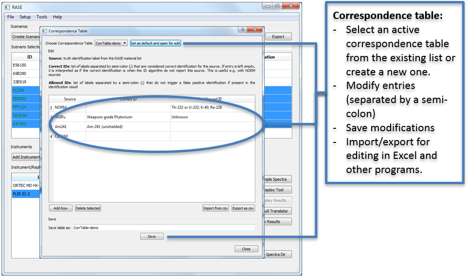

.. _extendedFunctionality:

***********************************************
Correspondence Table for Identification Results
***********************************************

The identification results correspondence table describes which isotope identification results count as success or failure for a given scenario,
thus affecting the score of a given identification algorithm (or replay tool). For example, if one isotope in the scenario is considered background
and does not need to be identified for a test to be successful, or if an identification result of “HEU/LEU” is considered a success for
a test on HEU, the correspondence table must be edited to reflect these choices. In other words, the correspondence table
provides the interpretative logic between the materials labels defined in the RASE scenarios and the identification labels
provided in the replay tool output.

The correspondence table can be managed using the dedicated window accessible under the “Setup” menu. This window allows
for manual input of table entries, as well as enables importing and exporting the table in a comma-separated \*.csv
format. \*.csv files can also be edited in Microsoft Excel program independently from the RASE software.

    "Correspondence Table" dialog, accessible from the "Setup" menu in the main RASE window.
