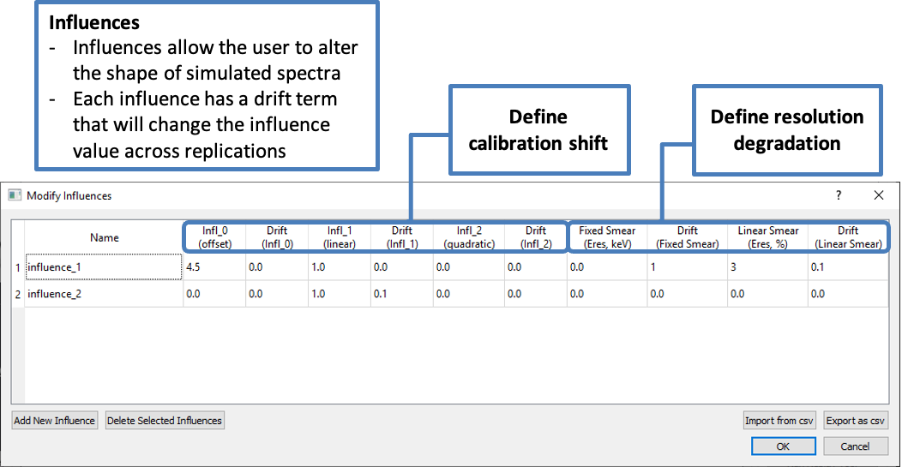

.. _influences:

***************************
Detector Influences in RASE
***************************

The influences functionality of the RASE code provides the user with a method for perturbing sampled spectra as a way to mimic energy
calibration distortions in response to the temperature, detector bias voltage, EMI interferences or other environmental effects.

The sampled spectra can be shifted along the energy axis using the following quadratic equation:

.. math::

    E' = C_0 + C_1 * E + C_2 * E^2

where

* :math:`E` is the original energy bin value in the sampled spectrum (defined by the energy calibration of the base spectra), keV;
* :math:`E'` is the resulting energy bin value after implementing the influence, keV;
* :math:`C_0` is a constant offset value, keV;
* :math:`C_1` is a linear offset coefficient (consistent with the gain change);
* :math:`C_2` is a quadratic offset coefficient.

The default values of the coefficients are set for no spectral distortion i.e. :math:`C_0=C_2=0`, and :math:`C_1=1`.

Please note that the three coefficients that define the influence do not substitute the original energy calibration
coefficients that are imported from the base spectra. Any influences are applied after the spectra are sampled. The
original energy calibration coefficients are recorded in the output .n42 sample spectra files as during the normal process.

Two additional terms, "Fixed Smear" and "Linear Smear", provide a way to distort energy resolution by convolving a Gaussian
function across the spectrum. This allows the user to simulate resolution degradation in addition to energy calibration
distortions. The two values are combined to form a user-defined "resolution distortion term", which serve to describe the
spread of the Gaussian in the following manner:

.. math::

   \sigma_{gaussian} = \Delta E = a + b*E

where

* :math:`\Delta E/E` is the energy resolution distortion across the energy spectrum (:math:`R_{User}`)
* :math:`a` is the "Fixed Smear" term, in units of keV. This term fixes the width of the convolved Gaussian and provides the same broadening irrespective of energy.
* :math:`b` is the "Linear Smear" term, in units of %. This term produces a broadening that provides a fixed percent broadening at any energy; in other words, the broadening varies with respect to energy such that the percent broadening remains constant. :math:`b` can be calculated via the equation:

.. math::

    b = \frac{\text{Full Width at Half Maximum}}{E_{Peak}} * 100

Note again that this term is provided in terms of percent (so if the user would like to depreciate the resolution by 1% the value "1" should be supplied, not "0.01")

The value :math:`R_{User}`, determined the :math:`a` and :math:`b` term, is related to the resolution of peaks in the output spectrum by the following equation:

.. math::

   R_{Final} = \sqrt{{R_{Initial}}^2 + {R_{User}}^2}

where :math:`R_{Initial}` is the resolution of the original peak and :math:`R_{Final}` is the resolution following the convolution.

Each term in the "influences" has a "drift" term. When this term is set to a non-zero value, the intensity of
the influence will increase across the replications in an additive manner. This is distinct from the typical meaning of
replications, where they represent a simulated set of identical, but statistically variable, measurements. As an
example of how they work: if :math:`C_0` is set to 0 and :math:`C_{0, drift}` is set to 1, :math:`C_0` in the
first replication will be set to 0, 1 in the second replication, 2 in the third, and so on. As another example, if
:math:`C_1` is set to 1 and :math:`C_{1, drift}` is set to 0.1, :math:`C_1` will be set to 1 in the first
replication, 1.1 in the first, 1.2 in the second, and so on.

Degradations can NOT be set to negative values. If any of the influences are set to a value less than zero, or if any ever dips below
zero in the process of drifting, it will automatically be set to 0.0001 (if :math:`C_1` is exactly 0 it will default back to 1, as is
the case when initially setting the influence values).

=======================================
A note about how influences are applied
=======================================

When creating a sample spectrum, influences are applied to the primary spectrum but only applied to the secondary
spectrum if it is classified as an internal calibration source (i.e.: it will not be applied to the secondary
spectrum if the secondary spectrum is defined as background).

=====================
Defining an influence
=====================

An influence can be defined in one of two ways:

* Navigate to the "Create/Edit Detector" dialogue (for example, by double-clicking on an existing instrument in the bottom table of the main window). Click on the "Add Influence to Detector" or "Modify Influences" in the bottom-left of the window
* Choose the "Modify Detector Influences..." option in the "setup" menu of the main GUI

When adding an influence, only the influence(s) currently being added to the table can be changed. When modifying
influences, all influences can be modified. If any influences are left blank, they will automatically be populated
with a value of zero (meaning no additional modification of spectra).

Deleting an influence from the influence table will remove the influence from any associated detectors and scenarios,
but will not delete those detectors/scenarios from the workflow. However, the ID of any scenarios associated with an
influence will change when that influence is deleted; any sample spectra that had been generated for that scenario
prior to deletion will no longer be recognized by RASE.

To add an influence to a detector, select the "Add Influence to Detector" from the instrument dialog. Highlight as
many influences as desired, and click "Ok". The highlighted influences will populate the detector influences list in
the detector creation/edit dialog. Influences can be removed from the detector by highlighting the influences and
clicking the "Delete Influence from Detector" button.

To implement an influence for an existing scenario, open the "Scenario Edit" dialogue (by double-clicking on a scenario
in the main window). Highlight the appropriate influences in the bottom field under "Influences". Repeat the procedure
for generating the sampled spectra for this scenario. "Switch off" the influences for the same scenario to generate
unperturbed spectra. Note that scenarios with influences can only generate spectra with instruments that have had
those scenarios added to them.

NOTE: Several influences can be activated at the same time. In this case, they will be applied sequentially to the
sampled spectra (i.e.: the spectrum will be distorted by influence 1, then the resulting spectrum will be distorted by
influence 2, and so on)

Example 1. A constant shift of sampled spectra by 100 keV can be defined using the following values for the three coefficients:
:math:`C_0` = 100, :math:`C_1` = 1, :math:`C_2` = 0. Note the :math:`C_1` = 1 is required in this case for the correct
mathematical operation.

Example 2. To mimic a distortion that stretches the spectrum by 10% use the following values for the three coefficients:
:math:`C_0` = 0, :math:`C_1` = 1.1, :math:`C_2` = 0.

|

.. _rase-InfluenceTable:

    **“Manage influences” dialog, accessible from the main window and from the detector creation window.**
