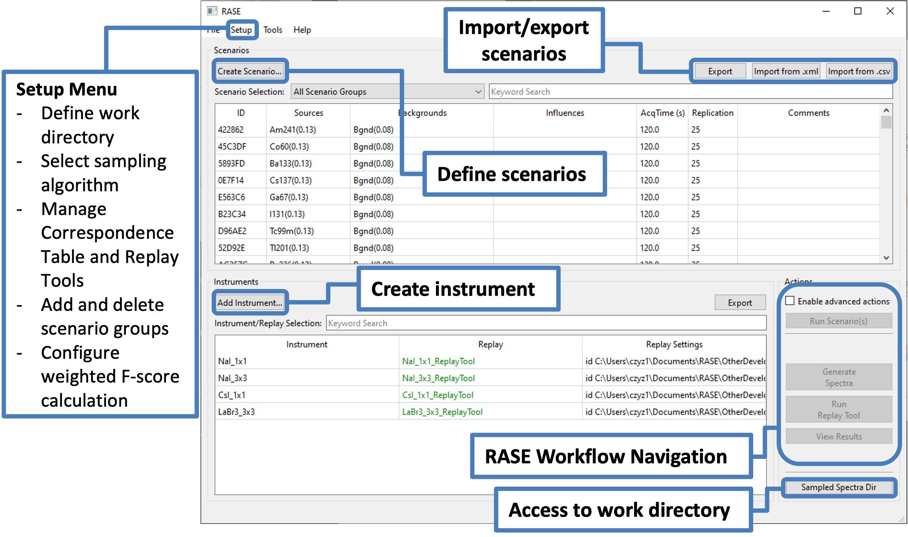

.. _mainWindow:

*****************************
RASE Main Window and Settings
*****************************

The RASE main window appears when the executable is launched, and is depicted in the figure below.

Prior to executing the RASE workflow, the user is encouraged to define a custom work directory where the RASE-generated
data (sampled spectra, replay tool outputs, and analysis reports) will be located. The work directory can be defined
using the “Preferences” dialog accessible through the “Setup” menu. The default location of data for Windows machines
is :code:`C:\Windows\Users\[UserName]\RaseData`  If the RASE work directory is modified, RASE should be restarted in order
for the change to take effect.

The RASE work directory can be accessed at any time from the RASE main window by clicking on the “Sample Spectra Dir”
button in the bottom-right corner.

The choice of sampling algorithm is also included in the "Preferences" dialog. This can be accessed and modified at any
stage of the analysis workflow. Additional options in the “Setup” menu include Replay Tool and the Correspondence Table
management. As is the case for the sampling algorithm, these can be accessed and modified at any stage of the analysis workflow.

The "Tools" menu contains a variety of add-on functionality (some under development) for extending RASE capabilities.
In particular, the user can fix the random seed number in order to generate identical spectra sets on different machines (for example, for a parallel independent analysis).
Also included is a tool for creating base spectra. Streamlining complex evaluations, such as the Minimal Detectable Amount (MDA), and dynamic, in-motion
measurement scenarios are also under development.

The main window provides access to the instrument and scenario definitions. Once these are defined, the steps of the RASE
workflow are executed using buttons in the bottom-right "Actions" area.

Materials that make up scenarios are shown in plain text, italics, or a combination of both. Materials that are in plain text are in units of dose rate (uSv/h), while those in italics are in units of flux (gammas/cm2s). 

The color-coding of the alphanumeric scenario IDs in the RASE main window corresponds to different stages of the RASE
workflow. It is activated when an instrument is selected:

*  Black: the scenario was defined, but sample spectra have not yet been generated.

*  Orange: Sample spectra have been generated for this instrument and scenario combination. The replay tool has not been yet executed.

*  Green: The replay tool has been successfully executed for this instrument and scenario combination.

*  Red: The selected instrument does not have base spectra for all of the sources that are defined in the scenario.

The instruments are also color coded with black, orange, and green, and follow the same coloring criteria as the
scenarios. If multiple instruments are selected, the color scheme of each scenario is limited by the instrument that
has progressed through the least of the workflow. This same logic applies when multiple scenarios are selected: the
color of each instrument is determined by the selected scenario that has executed the least of the workflow with that
instrument.

The replay tool has a simpler color scheme: the name is green if there is a command line replay tool executable
defined and the command line checkbox is checked. Otherwise, it is black.

.. _rase_mainWindow:

    RASE main window at the first start without pre-defined instruments or scenarios.
