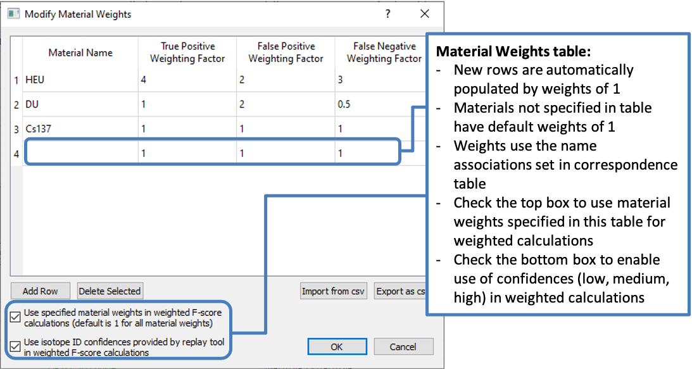

.. _weightsTable:

******************************
Weighted F-Score Calculations
******************************

RASE calculates various statistics based on scenario results, including True Positive (Tp), False Positives (Fp), False Negatives (Fn), Precision, Recall, and F-Score. RASE also calculates weighted versions of these quantities. The weighted calculation is described here and follows the prescriptions and methodology from  [AIP]_.

The *Weighted F-Score Manager Dialog* is provided to define the weights for each material. The same dialog allows the user to enable RASE's processing of the identification confidences if available in the replay tool output. When viewing results, the
weighted and unweighted values are both calculated and can be visualized in the table; weighted value columns are noted by a "w" before the statistic (e.g.: weighted Tp
is noted as wTp, weighted precision is noted as wPrecision, etc).

The weights table is accessible through the "Setup" menu in the main window as the "Weighted F-Score Manager..." option. Like most other tables in RASE, the material
weights table can be imported and exported to .csv files using the "Import from csv" and "Export to csv" buttons in the material weights table dialog. The table can also
be accessed from the results table; the results will update automatically to reflect any changes to the weights table (in the same manner as when the correspondence table
is edited).

Using the Material Weights Table
================================

To utilize the identification confidences that are reported by many instrument replay tools in calculating weighted ID statistics, the user should check the "Use isotope
ID confidences..." checkbox. RASE will look for confidence values that are either given as a text rating of "low", "medium", or "high" or given as a number between 0-10.
If the confidence is given as "low" or as a number between 0-3, the isotope IDs are given a weight of 1/3. Confidences of "medium" or a number between 4-6 are given a
weight of 2/3. Confidences of "high" or a number between 7-10 are given a weight of 1. If the user selects this option, but no confidence values are given in the replay
tool output, all IDs are given a default weight of 1. Note that regardless of if this checkbox is selected only the weighted versions of these statistics are affected. ID
confidence does not play a part in calculating the weighted Fn rate, because the isotope was not identified and therefore has no confidence associated with it.

The material table allows the user to specify unique Tp, Fp, and Fn importance weighting factors to materials. If the user would like the weighted F-score to be calculated
by taking into account these user-specified material weights, the "Use specified material weights..." box should be checked. Materials will appear as selectable in drop-down
boxes in the "materials" column of the table if they have already been imported as base spectra for a detector. If a material is given an importance weighting, it is applied
to the calculation of the weighted statistics regardless of if the material is defined in the scenario; this means that user-specified weights can be applied to false
positives. If material is not explicitly specified in this table, RASE interprets the Tp, Fp, and Fn importance weights of that material as 1, and will contribute the
same amount as in the unweighted calculations.

Material Weights Table interaction with the Correspondence Table
================================================================

Materials specified in the weights table follow the same material identification logic outlined by the correspondence table. Weights have no impact on isotopes
specified as "Allowed IDs" in the correspondence table if that material is in the scenario definition; these IDs have no impact on the weighted Tp, Fp, or Fn values
calculated for a scenario.

If the user has specified a material<->ID equivalency in the correspondence table multiple times and those multiple materials are included in a scenario definition, and 
if the ID associated with the multiple materials is identified, then the largest weighting factor for each term are used. For example: "Uranium" is defined as a correct
ID for "DU" and "HEU". If the user defines a scenario that includes both DU and HEU, and "Uranium" is identified by the replay tool, the higher Tp of the two materials
will be used as the weight for the Tp, and likewise for Fp and Fn. The maximum is determined separately for each weighting factor.

An example of weighting
=======================

The user defines a single-replication scenario which includes HEU and WGPu. The user uses the table to specify importances (Tp, Fp, Fn) of (4, 2, 3) for HEU and
(1, 2, 0.5) for DU, while not explicitly specifying WGPu. The user also checks the box allowing confidences to be used in weighted calculations. The replay tool
identifies WGPu at a confidence of 9 and DU at a confidence of 2. The unweighted results will be reported as Tp = 1 (correctly ID'd WGPu), Fp = 1 (wrongly ID'd DU),
and Fn = 1 (failed to ID HEU). The weighted results will be reported as wTp = 1 (WGPu was correctly identified and since it was not given a weight by the user the
material weight for Tp defaults to 1, and since it was identified with a confidence of 9, or "high", it is given a confidence weight of 1: 1 * 1 = 1), Fp = 0.667
(the user provided a Fp weight of 2 for DU, and it was ID'd with a confidence of 2, or "low", so it is given a confidence weight of 1/3: 2 * 1/3 = 0.667), and Fn = 3
(the user provided a Fn weight of 3 for HEU, and because HEU was not identified there is no ID confidence associated with it). If more replications are run, the
results will be averaged across all replications.

|

    **"Material Weights Table" dialog, accessible from the "Setup" menu in the main RASE window.**
