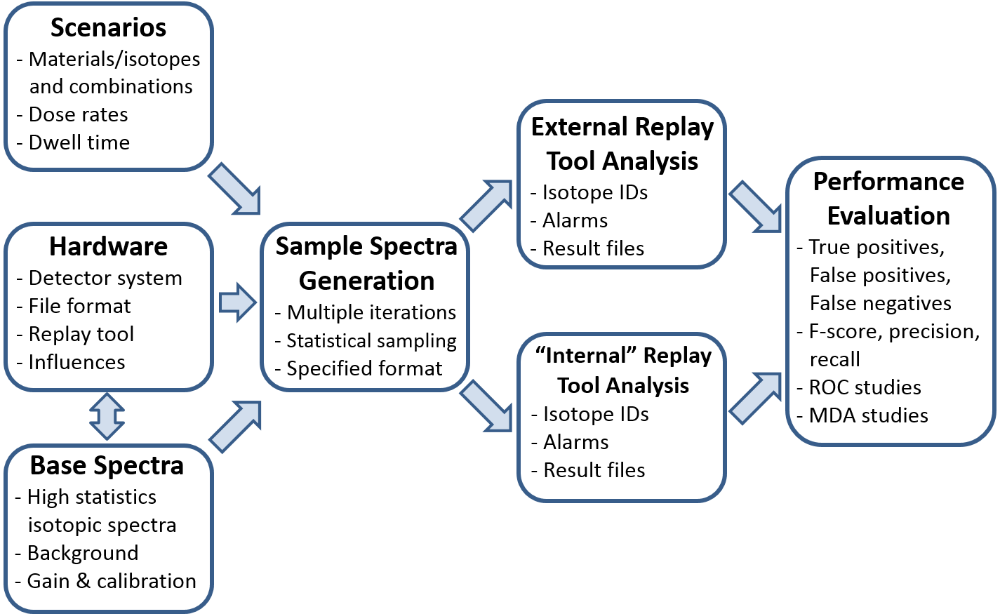

.. _workflowOverview:

**********************
RASE Workflow Overview
**********************

The overall RASE evaluation workflow is shown in the figure below. The
current version of the software implements seamless end-to-end functionality.

First, instruments are defined and their corresponding base spectra loaded. Scenarios can then be defined to reproduce measurements conditions of interest. Generation of the synthetic spectra (sampled spectra) follows, and after completion, they can be injected into the instrument replay tool for analysis. This analysis can be done seamlessly within the RASE code if a command-line replay tool is defined. Alternatively, a stand-alone replay tool can be used outside of RASE for isotope identification. Finally, the output of the identification analysis is loaded into RASE and can be inspected for evaluating the instrument performance.

RASE has been tested to be compatible with about 30 different spectrometric instruments and their base spectra. Access to the base spectra library is given upon request and requires approval. For most of the RASE-compatible instruments, a vendor-supplied replay tool has been integrated.

|

.. _rase-workflow:

    **RASE analysis workflow and functionality.**
