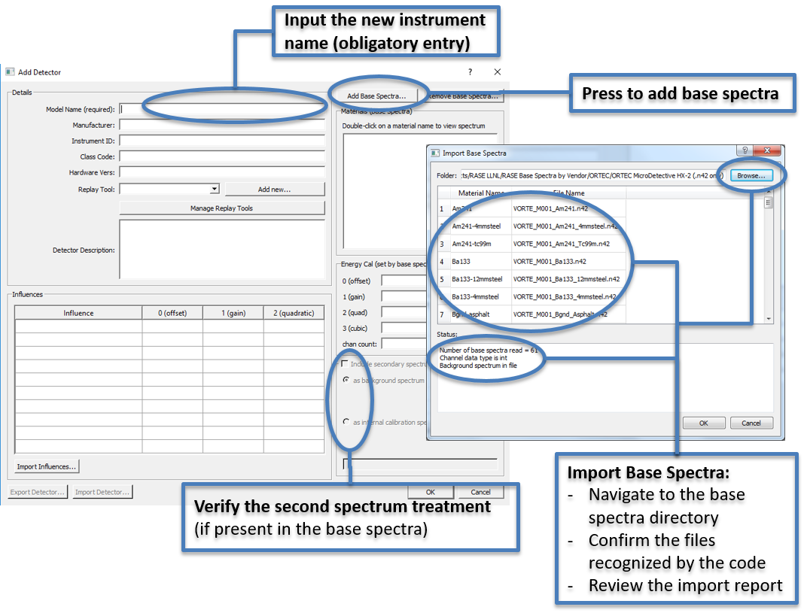

.. _workflowStep1:

*******************************************
RASE Workflow Step 1: Instrument Definition
*******************************************

The “Add instrument” dialog window (Figure below) is called by clicking the “Add Instrument...” button in the main RASE window.

The user is required to enter an arbitrary name for the instrument in the top-left dialog. All other entries in this area are optional.

To associate a set of base spectra with the new instrument, press the “Add Base Spectra” button in the top-right area of the dialog.
In the new window that pops up, navigate to the directory that contains the base spectra in the appropriate .n42 format and press the “Select Folder” button. Review the
base spectra metadata and import details, then press “OK”.

The RASE software will automatically recognize if a second spectral data entry is present in the base spectra. Secondary spectra are sometimes required by certain replay tools.  The user will be prompted
to select whether the secondary spectrum is a background spectrum (as in the ORTEC HPGe hand-held instruments) or an intrinsic calibration source spectrum (as in the FLIR IdentiFinder-2 instrument).
The checkbox “Include secondary spectrum in sampled spectra” with the associated radio button will be automatically selected.

All other entries in the “Add Instrument” dialog can be modified later in the workflow and are covered later in this documentation.

.. _rase-WorkflowStep1:

    “Add Instrument” dialog.
