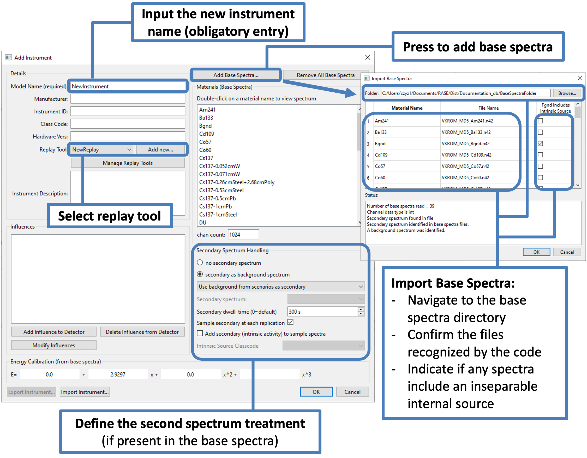

.. _workflowStep1:

*******************************************
RASE Workflow Step 1: Instrument Definition
*******************************************

The “Add instrument” dialog window (Figure below) is called by clicking the “Add Instrument...” button in the main RASE window.

The user is required to enter an arbitrary name for the instrument in the top-left dialog. All other entries in this area are optional.

To associate a set of base spectra with the new instrument, press the “Add Base Spectra” button in the top-right area of the dialog. In the new window that pops up, navigate to the directory that contains the base spectra in the appropriate .n42 format and press the “Select Folder” button. Review the base spectra metadata and import details, then press “OK”.

The RASE software will automatically recognize if a second spectral data entry is present in the base spectra. Secondary spectra are sometimes required by certain replay tools.  The user will be prompted to select whether the secondary spectrum is a background spectrum (as in the ORTEC HPGe hand-held instruments) or an intrinsic calibration source spectrum (as in the FLIR IdentiFinder-2 instrument). If the secondary spectrum is set as a background, the user may proceed in one of three manners:

    1: The user may select one of the base spectra that has been associated with the detector to serve as the secondary spectrum. This option can be used in cases where the user would like to simulate taking a specific background prior to executing the measurement campaign, which might be in a different location and consequently have a different background.

    2: The secondary spectrum will be automatically populated by the background(s) that are used to define a "scenario" (combinations of sources and backgrounds that can be paired with an instrument to simulate spectra; scenarios are described in more detail in the next section). If the user defines more than one source of background, the secondary spectrum will be a combination of the multiple sources, weighted according to their respectively defined intensities. In this case, the secondary spectrum will be different for each scenario (as opposed to the same across all scenarios simulated for a certain detector). If this option is selected, the user may not run a scenario where background is not defined.

    3: The secondary spectrum will simply be a direct copy-and-paste of the secondary spectrum from one of the isotopes included in the base spectra set. If the base spectra have different secondary backgrounds, RASE will select one of the base spectra and use the background in that file for all spectra generated for that detector. As the spectra loaded into RASE are usually background subtracted, the secondary spectrum found in the base spectra files often provides no useful information. As there is a possibility that the secondary background is used by an algorithm for background subtraction, this option is usually not recommended.

If the secondary spectrum is an internal calibration spectrum and "internal calibration source" is selected, the secondary spectrum will be sampled and contribute counts (weighted appropriately) to any sample spectra generated for that detector. In this case it is important that the secondary spectrum is an accurate representation of what the main detector would record *from the calibration source alone*, with no additional background signature. This is not always the case: the internal calibration source may be measured using a secondary detector and/or may not be uniquely separable from the background base spectrum. In instances such as this, the user should follow the guidance described in the ":ref:`intrinsic_source_handling`" section. 

Once base spectra are loaded, they can be quickly reviewed within RASE by double-clicking on a material name within the "Edit Detector" dialog. A separate plotting dialog will be displayed.

All other entries in the “Add Instrument” dialog can be modified later in the workflow and are covered later in this documentation.

|

.. _rase-WorkflowStep1:

    **“Add Instrument” dialog.**
