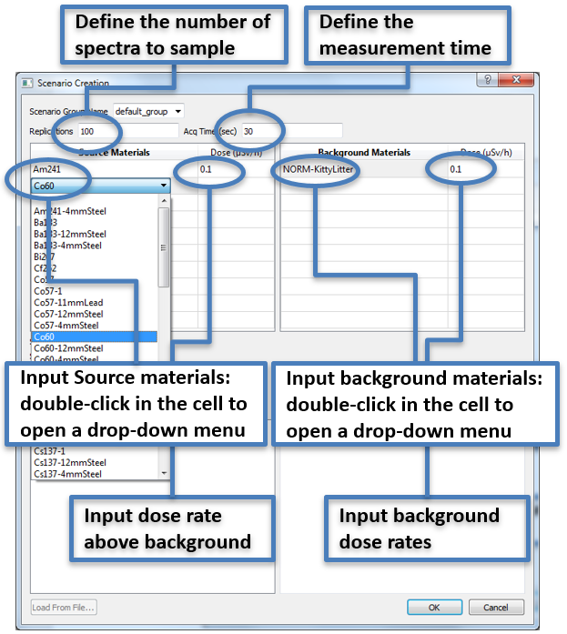

.. _workflowStep2:

*****************************************
RASE Workflow Step 2: Scenario Definition
*****************************************

The “Scenario Creation” dialog (figure below) is available by clicking the “Create Scenario” button in  the main RASE window.

To add a material (isotope) to the scenario, double-click in the first cell of the table in the top-left area of the window.
Select the appropriate entry from the drop-down list. Available material options are defined by the inventory of base spectra
associated with the previously added detectors. If no detectors are defined, no materials will be available to create the scenarios.

Input the dose rate above background (uSv/h) for each material in the second cell of the table (the default value is 0.1 uSv/h). 
Entering a range of dose rates in the format [min]-[max]:[step] will produce multiple scenarios, one with each of the requested dose rates.

Define the acquisition time in seconds (the default value is 30 sec.).

Define the number of replications (the default value is 100). This parameter determines how many sampled spectra will be created in this scenario.

.. _rase-WorkflowStep2:

    “Add Scenario" dialog.
