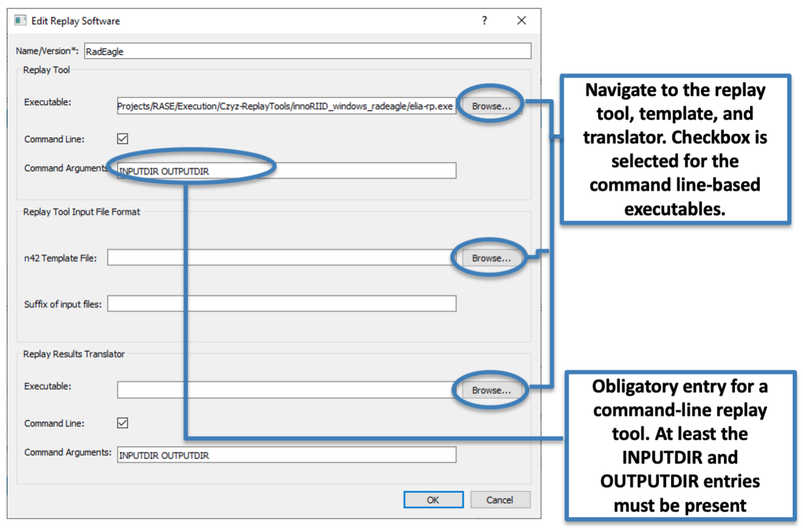

.. _workflowStep3:

************************************************************
RASE Workflow Step 3: Define the Replay Tool and Translators
************************************************************

NOTE. This step is not required to generate populations of sampled spectra with the RASE code. The user can skip this step, generate scenarios and sampled spectra, and define the replay tool later.

Before the "Run Replay Tool" button on the main window can be activated, the instrument must have its replay tool specified.

Two types of replay tools can be implemented in the RASE workflow:

*  Command line-based tools can be executed directly from the RASE main window

*  Stand-alone replay tools that should be manipulated outside of the RASE software

In addition to the replay tool, the user must specify an instrument specific n42 template and a identification results translator in order to ensure compatibility of the RASE file formats with instrument-specific spectral and replay tool output files.
See :ref:`requirements` for more details on these.
The user should be aware of the instrument manufacturer's instructions on replay tool operation and the command line syntax requirements. For convenience, some example of configuration settings for replay tools are provided in :ref:`replayToolSettings`.
If necessary, these may be provided by the RASE code developers, and may require specific settings.

To define the replay tool:

*  Double-click on an entry in the “Instruments” table

*  In the “Edit Instrument” window, click the “New” button near the “Replay Tool” field.

*  In the “New Replay Software” dialog, use the “Browse” button to navigate to the command line replay tool executable. Make sure that the “Command line” checkbox is selected.

*  In the “Replay Settings:” field, type in the command line parameters (obligatory). The RASE software will automatically substitute the INPUTDIR and OUTPUTDIR entries with the path to the directories where the sampled spectra and replay tool results are located.

*  Similarly, use the "Browse" buttons to identify the path to the “Replay Tool n42 Input Template” and the “Replay Results Translator.”

Once the replay tool is defined, the “Run Replay Tool” and "Run Results Translator" buttons become available in the RASE main window.
The entry in the “Instruments” table should now list your newly defined replay tool.

Replay tool settings can be edited at any time by double-clicking the replay tool name in the “Instruments” table.

Once the replay tool is defined, it can be assigned to any other instrument by using a drop-down menu near the “Replay”
field in the “Edit Instrument” window.

.. _rase-WorkflowStep3:

    “Define Replay Tool” dialog.
