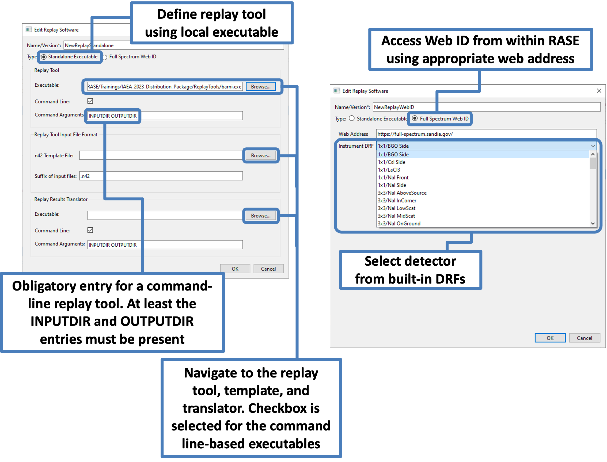

.. _workflowStep3:

**********************************************
RASE Workflow Step 4: Generate Sampled Spectra
**********************************************

Confirm that the desired instruments and scenarios are present and properly specified in the appropriate tables.
If necessary, entries in the “Scenarios” and “Instruments” tables can be modified or deleted by the user by double-clicking
on the corresponding row or using the context menu.

At this point, RASE can be used to generate sampled spectra. To do this, execute the following steps:

#.  Highlight one or more entries in the “Instruments” table

#.  Highlight one or more entries in the “Scenarios” table

#.  Press the “Gen Sampled Spectra” button that becomes available in order to generate the sampled spectra.

If a selected instrument does not have base spectra for materials present in the scenario, the “Gen Sampled Spectra”
button remains unavailable. The missing materials for the instrument will be highlighted red in the “Scenarios” table.

The directory containing the resulting sampled spectra can be accessed by pressing the “Sample Spectra Dir” button.
If an n42 template file was specified in the replay tool settings associated with the current instrument, then a second
directory will also be present containing the sampled spectra in the format ready for injection in the specified replay
tool.

The directory containing data associated with the specific scenario can be accessed using the context menu in the
"Scenarios" table. An instrument must be selected in order for this option to become available.

.. _rase-WorkflowStep3:

    Populated main RASE window showing how to generate sample spectra.
