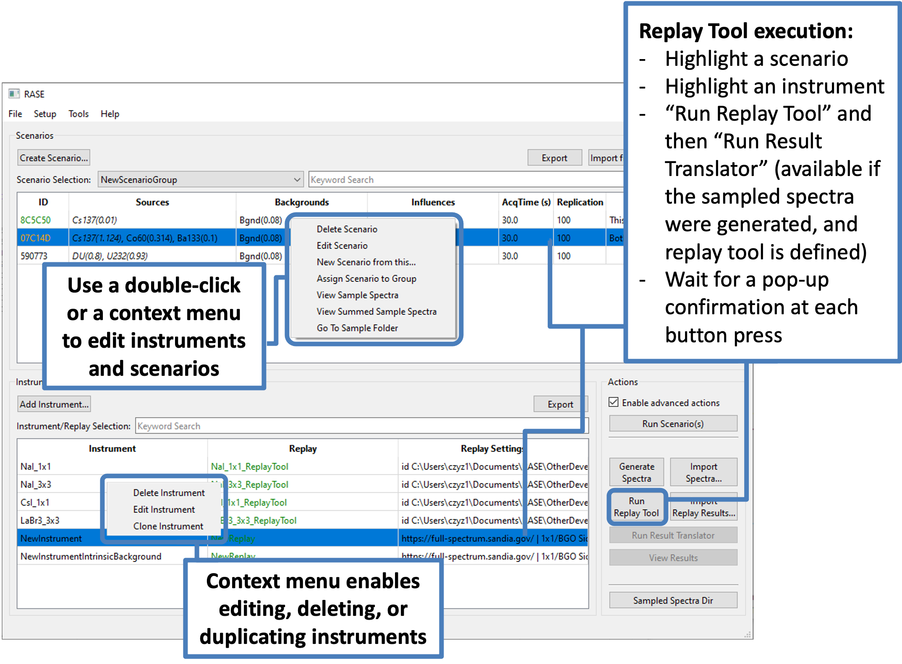

.. _workflowStep5:

*************************************************************
RASE Workflow Step 5: Execute the Replay Tool and Translators
*************************************************************

Once the replay tool is defined for the instrument and the sampled spectra have been generated for a scenario, highlighting
both the instrument and at least one scenario in the main RASE window makes the “Run Translator”, “Run Replay Tool”, and "Run Result Translator" buttons available to the user.

The “Run Replay Tool” button executes the command line-based replay tool and creates a sub-directory with the identification
report files for each sampled spectrum. 
This directory will also contain the terminal output of the replay tool, useful for troubleshooting.

The "Run Result Translator" button creates a third sub-directory with the identification report files in a format compatible
with the RASE code.

For a stand-alone replay tool, switch to the external vendor-provided software to process the sampled spectra and then use the 
“Import Results...” button.

.. _rase-WorkflowStep5:

    “Add Detector” dialog.
