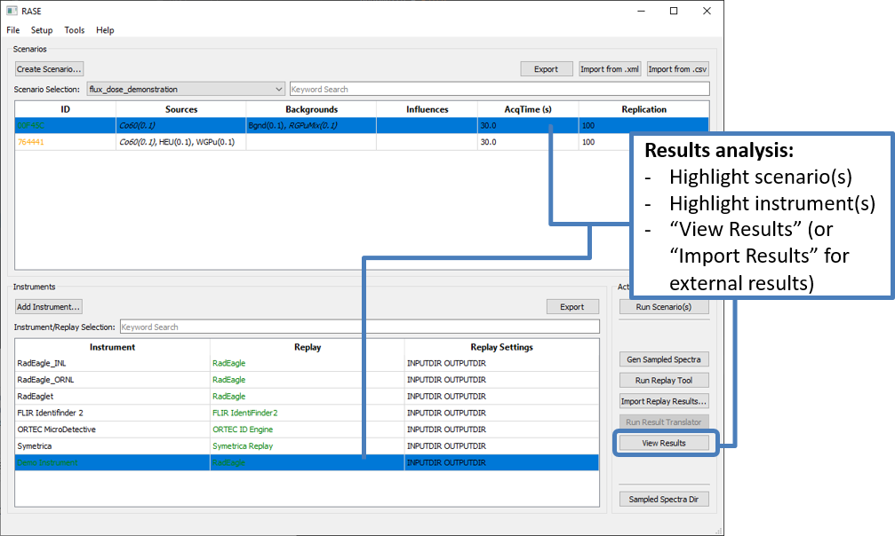
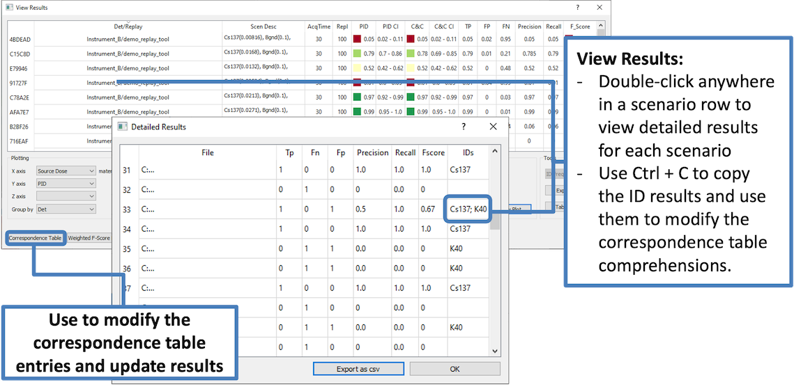

.. _workflowStep6:

*************************************************************
RASE Workflow Step 6: Replay Tool Results Analysis
*************************************************************

The “View Results” button will display the table with a summary of the replay tool results for the selected instrument
and scenario combination.

Detailed identification results for each individual spectrum can be reviewed by clicking on the scenario title in the
first column of the "View Results" table. Detailed identification results are useful to identify spectra that provided unexpected results or to determine how to adjust the correspondence table comprehensions to better match the objectives of a specific study.
Use Ctrl+C or right-click to copy the ID results and use the exact entries to modify the correspondence table comprehensions.

The tables in the "View Results" and "Detailed Results" dialogs can be exported as a \*.csv file and processed in Excel for plotting and extended analysis. Note that the capability to plot results within RASE is currently not enabled.

The RASE-generated sampled spectra and replay tool outputs can be reviewed
manually using programs like PeakEasy.

RASE uses the unweighted F-Score methodology based on the geometric mean of precision and recall to evaluate the identification
performance of an algorithm. For more details on the F-Score see [AIP]_

.. _rase-WorkflowStep6:

    Main RASE window showing how to access identification results dialogs

    “View Results” and "Detailed Results" tables.
