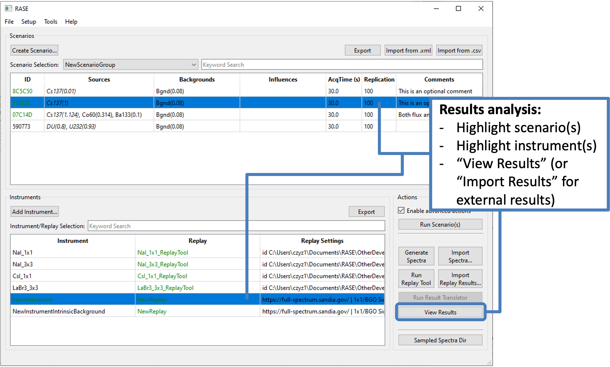

.. _workflowStep6:

*************************************************************
RASE Workflow Step 6: Replay Tool Results Analysis
*************************************************************

View Results
============

The “View Results” button will display the table with a summary of the replay tool results for the selected instrument
and scenario combination. If multiple scenario/instrument combinations are selected, the results button will remain clickable so long as
at least one instrument/scenario combination in the selected instruments/scenarios has results that are ready to be viewed.
The number of columns displayed in the view results dialog can be customized via the table settings dialog, using the "Table Settings" button.
The user may also freely modify the correspondence table using the "Correspondence Table" button, which will update the results table live.
If a material name is in the format of XXnnn (e.g.: Rn226, K40) and the material is set as a source material, RASE will automatically look for
"XX-nnn" as well as "XXnnn" when calculating the results (so if Cs137 was defined as a material, RASE would consider an identification of
Cs-137 and Cs137 as "correct IDs"). This is not done when a material of this format is defined in the background (so Cs137 and Cs-137 are
considered as two separate identifications). For background materials, the equivalence must be enforced manually and on an isotope-by-isotope
basis in the correspondence table.

**Detailed identification results** for each individual spectrum can be reviewed by double clicking on the row of interest in the "View Results" table. Detailed identification results are useful to identify spectra that provided unexpected results or to determine how to adjust the correspondence table comprehensions to better match the objectives of a specific study.
Use Ctrl+C or right-click to copy the ID results and use the exact entries to modify the correspondence table comprehensions.

For each scenario, RASE also computes the **frequency of identification results** from all the generated samples. This analysis can be accessed by right-clicking an entry in the "View Results" table and selecting the "Show Identification Results Frequency" menu.

The tables in the "View Results" and "Detailed Results" dialogs can be exported as a \*.csv file and processed in Excel for plotting and extended analysis. The RASE-generated sampled spectra and replay tool outputs can be reviewed manually using programs like PeakEasy and Interspec.

|

.. _rase-WorkflowStep6a:

    **Main RASE window showing how to access identification results dialogs**

|

.. figure:: _static/rase_WorkflowStep6-2.png
    :scale: 65%

    **“View Results” and "Detailed Results" tables.**

|

RASE uses both an unweighted and weighted F-Score methodology based on the geometric mean of precision and recall to evaluate the identification
performance of an algorithm. For more details on the F-Score see [AIP]_.

Confidence intervals in RASE are are determined using the Wilson Score approach. Wilson Score intervals are biased
towards 0.5, and are asymmetric, but have been shown to have a more accurate performance than "exact" methods such as
Clopper-Pearson, which tend to be overly conservative (see Newcombe, 1998).

Each term in the view results table is calculated independently for each sample spectrum, and then averaged across
all replications for a given scenario. The information in the columns are defined as follows:

.. math::
   Prob_{\text{ID}} = \begin{cases}
                        1, & \text{if all isotopes are correctly identified}\\
                        0, & \text{otherwise}
                      \end{cases}
.. math::
   {\text{CIs (for both } Prob_{\text{ID}} \text{ and } C\&C)} = {\text{Upper and lower confidence interval bounds for a given } \alpha}
.. math::
   {\text{True Positives}} = \frac{\text{# of true positives}}{\text{total # of sources in scenario}}
.. math::
   {\text{False Positives}} = {\text{Number of identified isotopes that were not defined in the scenario sources}}
.. math::
   {\text{False Negatives}} = {\text{Number of isotopes defined in the scenario sources that were not identified}}
.. math::
   C\&C {\text{ (Complete \& Correct)}} = \begin{cases}
                                        1, & \text{if all sources are correctly ID'd with no false positives}\\
                                        0, & \text{otherwise}
                                        \end{cases}
.. math::
   Precision = \frac{\text{# of true positives}}{\text{(# of true positives) + (# of false positives)}}
.. math::
   Recall = \frac{\text{# of true positives}}{\text{(# of true positives) + (# of false negatives)}}
.. math::
   F_{\text{Score}} = \frac{2 \times \text{Precision} \times \text{Recall}}{\text{Precision + Recall}}

Plotting
========

RASE includes 1D, 2D, and 3D built-in plotting capabilities. Using the drop-down selection boxes in the bottom left of the "View Results" window, the user may select any of the possible results columns to form plots from. Selecting an option exclusively for the x axis will result in a histogram plot for the chosen results column. Selecting options for both the x and y axes will create a 2D plot. Selecting an option from the z axis drop-down menu will produce a heat map of that column as a function of the results from the x and y columns. If the user chooses source/background dose/flux as one of the axes, they will be prompted to choose one of the source/background isotopes to plot. The "Category" option allows the user to further break up results into several relevant groups. For example, the user may choose "Detector" as a category for plotting pID vs Source Dose; if there are results for more than one detector in the results table, the results for these two detectors will be plotted in different colors on the same plot. Clicking "View Plot" will bring up a plotting dialog displaying the selected data.

S-curves
--------

The plotting capabilities are particularly specialized for S-curve fitting. In the plotting dialog the user may select which dataset to fit curves to (if categories are defined), and set a percent for ID threshold estimation. Pressing "Plot S-Curve" will fit a sigmoid trendline, if possible. The fit is done using a Boltzmann Sigmoid function defined as:

.. math::
   y_{Fit} = a_2 + \frac{a_1 - a_2}{1 + e^{-(x-M)/B}}

This plot works for curves where the identification rate is positively correlated with source intensity as well as negatively correlated. If the fit is successful, the S-curve is plotted with a 1-sigma confidence interval surrounding the line and a point is marked on the plot where the trendline crosses an ID threshold (default is 80%, but can be varied by the user). The x-value of this crossing point is noted in the legend. These graphical features can be toggled on or off. Detailed fit results are displayed in the text box to the left. While the fitting algorithm is sufficiently robust, it may be necessary to manually adjust the fit parameters to help convergence. The fit parameters for each curve are accessible through the "Edit S-Curve Fit Parameters" button.   Various properties of the plot, including title and axes scale/labels, can be modified by the user. The plot can be exported in the user's favorite image file format.

|

.. figure:: _static/rase_WorkflowStep6-3.png
    :scale: 33%

    **Plotting interface and S-curve fits**

|

3D Plotting - Heat Maps
-----------------------

Heat maps are only possible to create where exactly one result exists at each intersection point of a grid of permutations created by the x and y variables: for example, if the user were to define all permutations with source A at dose rates 0.1, 0.2, and 0.3 :math:`{\mu}`\ Sv/hr and source B at dose rates 0.4, 0.5, and 0.6 :math:`{\mu}`\ Sv/hr (so 9 total scenarios), it would be possible to create a continuous heat map of results. However, if the user were to include an additional scenario in these results where source A = 0.1 :math:`{\mu}`\ Sv/hr, source B = 0.4 :math:`{\mu}`\ Sv/hr, and source C = 0.7 :math:`{\mu}`\ Sv/hr (so 10 total scenarios), the heat map would fail to generate because there is already results for a scenario where source A = 0.1 :math:`{\mu}`\ Sv/hr and source B = 0.4 :math:`{\mu}`\ Sv/hr. If instead the user did not define, for some reason, the scenario where source A = 0.2 :math:`{\mu}`\ Sv/hr and source B = 0.3 :math:`{\mu}`\ Sv/hr (so 8 scenarios total), the heat map would have a large section undefined due to this result missing from the grid.

To add convenience for the user, a "Ignore isotopes with zero contribution" checkbox also exists. This is applicable specifically if the user is planning to look at the results of several possible permutations in quick succession. For example, the user has created three permutation sets of 9 scenarios each:

    - Set 1:

        - source A at dose rates 0.1, 0.2, and 0.3 :math:`{\mu}`\ Sv/hr
        - source B at dose rates 0.4, 0.5, and 0.6 :math:`{\mu}`\ Sv/hr

    - Set 2:

        - source A at dose rates 0.1, 0.2, and 0.3 :math:`{\mu}`\ Sv/hr
        - source C at dose rates 0.7, 0.8, and 0.9 :math:`{\mu}`\ Sv/hr

    - Set 3:

        - source A at dose rates 0.1, 0.2, and 0.3 :math:`{\mu}`\ Sv/hr
        - source D at dose rates 1.0, 1.1, and 1.2 :math:`{\mu}`\ Sv/hr

If the user attempts to create a heat map with the X-axis defined as the "Source Dose" of source A and the Y-axis as the "Source Dose" of source B, the map will fail to generate because RASE has implicitly assumed that source C and source D also exist in those scenarios with a dose rate of 0. By checking the "Ignore isotopes with zero contribution" checkbox, these instances are ignored when creating the heat map. This lets the user quickly examine all three sets of scenarios.

.. _rase-WorkflowStep6b:

.. figure:: _static/rase_WorkflowStep6-4.png
    :scale: 80%

    **An example of plotting 3-dimensional data as a heat map.**
