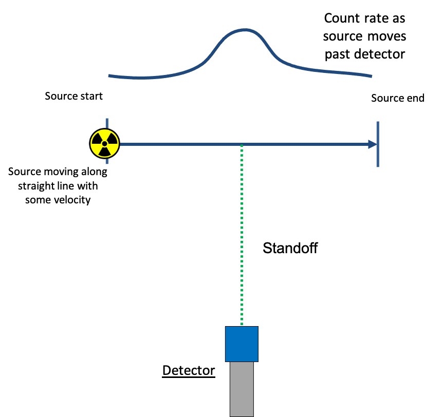

.. _dynamic_introduction:

*************************
Dynamic RASE Introduction
*************************

Dynamic RASE is an extension of the RASE methodology into non-static situations, where the user may need to evaluate the performance of a detector/replay tool when the source(s) and detector are in relative motion. Detectors for such use cases include radiation portal monitors, backpack radiation detectors, and handheld detectors operating in search mode. Dynamic RASE makes it possible to simulate the response of such detectors/replay tools as they travel along user-defined paths through radiation fields from arbitrary combinations of sources. Like Static RASE, simulated spectra created in Dynamic RASE are output as vendor-formatted spectra files (either static or periodized/dynamic) that can be supplied to a replay tool for isotope identification results.

.. _dynamic-introduction:

    **A typical scenario that could be modeled using Dynamic RASE**
