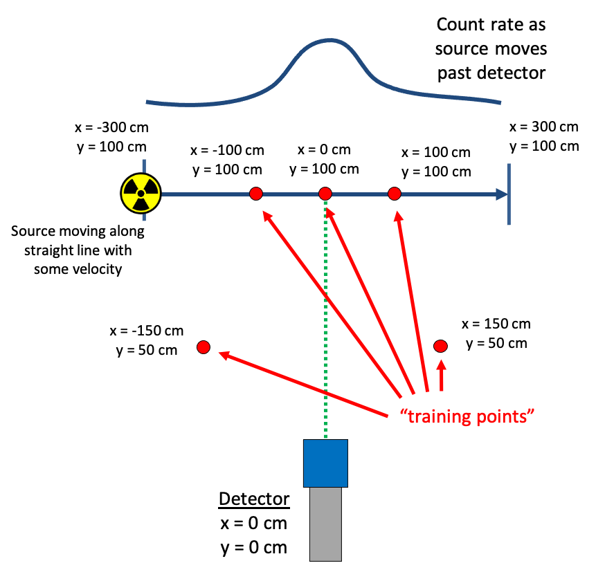
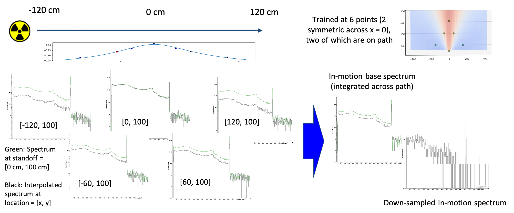

.. _dynamic_mechanics:

*************************
Mechanics of Dynamic RASE
*************************

Dynamic RASE utilizes the same downsampling methodology as Static RASE, but along a path: instead of sampling from one fixed base spectrum for the entirety of the simulation, the sampled base spectrum varies depending on where in space the detector is. The base spectrum at any given point is determined via a detector response map, interpolated and extrapolated through all space using a "Gaussian process". The response map is built from a set of user-provided long-dwell static base spectra, or "training points", collected by placing the source at several locations about the detector. A unique interpolation is created throughout space for each energy bin, which allows for effects of different environmental conditions, such as shielding, to be correctly adjusted for with respect to position. The base spectra are scaled by live time, so a set of spectra can consist of measurements with many live times (often necessary to achieve reliable and representative counting statistics, particularly in instances with shielding or with wide angle/distant sources).

    **One example of where to take several long-dwell measurements (training points) to generate the detector response map**

Gaussian Process
================

The interpolation used in Dynamic RASE is powered by a Gaussian process model. This model determines the relationship between data points using a "kernel", which is defined such that points that are close together in space are closely correlated, while points that are far apart are uncorrelated. In the context of Dynamic RASE, the data points that are passed to the kernel are the counts in the base spectra that are supplied by the user. The Gaussian process uses the relationships between the points as yielded by the kernel to generate numerous smooth curves running through the data points. The smooth curves converge to a single "best fit" curve, which creates the 3D detector response map. A unique Gaussian process model is created for each energy bin, such that if the base spectra sets have have x bins there will be x unique models.

The kernel used in Dynamic RASE is a compound kernel constructed from an angular component and a radial component, and computes correlations in spherical space. Assuming the face of a detector is located at (x, y, z) = (0, 0, 0) this means that, in the eyes of the Gaussian process, data sourced from a measurement at (30, 30, 0) and at (150, 150, 0) will be in the same location to the angular component while very far apart in the radial component, while the points (-50, 50, 0) and (50, 50, 0) will be at the same location in the radial component and far apart in the angular.

If there are any realistic assumptions that can be made and applied to the data before passing it to the Gaussian process, the rate of successful fit can be improved. When dealing with radiation sources, one good assumption to make is that by default that radiation is emitted isotropically and that the intensity falls off at 1/r^2. The Gaussian process conducts its fits on data after it has been transformed by accounting for the expected 1/r^2 behavior. The response map is normalized by the regression coefficient to be centered at zero; a response map for a set of measurements with perfect 1/r^2 behavior would be flat, equaling 0 everywhere. Because of this, in the absence of additionally supplied data the Gaussian process will always trend back to 0 (i.e.: only 1/r^2 effects). Regions or training/sample points with lower count rates than would be expected from a flat 1/r^2 map (e.g.: due to geometric effects or shielding) appear as negative, while regions with higher count rates appear as positive. Unless the response is perfectly in line with 1/r^2 (at which point every point would be 0), each map is expected to have at least one point negative and at least one point positive.

The Gaussian process has no "quality" restrictions for supplied spectra, and takes counting statistics into consideration when conducting a fit. If the user provides a spectrum with good counting statistics, the Gaussian process will weight that point highly and is thus more likely to pass through, or very near, to it. If the spectrum has poor counting statistics, the Gaussian process will still use that point in the fit but will give it little weight. Because of this weighting it is unlikely that adding more data, even data that has poor counting statistics, will be significantly detrimental to a fit.
In light of this, users will likely benefit from providing several measurements with modest collection times instead of a small number of measurements over longer times.

The Gaussian process method infers a "length scale" in the radial kernel, and an analogous parameter in the angular kernel. These parameters describe the distance at which two points are considered "close" and therefore highly correlated in the model. The Gaussian process software will fit these length scales based on the input data. As such, the presence of data that shows large changes in radiation intensity over short changes in radius or angle will cause the Gaussian process to infer a short length scale. In scenarios where these short-distance changes are present (e.g. scenarios with shielding with sharp edges), good accuracy from the Gaussian process model will require more finely-spaced input data than in scenarios where the radiation detection behavior is inherently smooth over longer distances.

The current release of Dynamic RASE has only one kernel available to users. Additional kernels are in development. These modified kernels will offer users the option to impose assumptions on the model. Users interested in these features should contact the developers.

Sampling Along a Path
=====================

Defining a scenario in Dynamic RASE requires that the user supply a list of sources involved in the scenario (and their respective intensities), the detector under test, and a path traveled by the source(s) in relation to the detector. To create a path in Dynamic RASE, the user sets a starting point (in 3D space), ending point, and travel time. The user also specifies the "output period", which indicates how often an integrated sample spectrum is created, and a "sample frequency", which indicates how many sub-samples make up a period. Depending on how the user defines the output period, Dynamic RASE will either create one spectrum, which is the total spectrum observed by the detector as the source travels along the full path, or several spectra in time series, with each representing the spectrum acquired during an output time period.

To create an accurate simulation, the user-defined path is broken up into many uniformly distributed positions, or "sample points", in 3D space, as specified by the user-provided sample frequency. Note that the user should make sure there is enough points to capture any significant fluctuations in the detector response along the path. At each sample point the response map for one of the sources in the scenario definition is queried at every energy bin to determine what the expected counts in that bin would be if source was located at that position. The queried spectrum is then scaled by the "dwell time", calculated as the total travel time divided by the total number of sample points. The spectrum, bin-by-bin, is then converted to a sample spectrum by randomly sampling from the Poisson distribution, where :math:`\lambda` is equal to the counts in that bin that are expected to be observed during the dwell time, and then scaled to the appropriate source strength as set by the user in the scenario definition. This is repeated for every source defined in the scenario, with the new source sample spectrum being added to that of the previous source(s). The resulting sample spectrum at each point is summed together with other sample spectra across each user-defined output period to give a representation of what the detector would have seen from the source as it traveled across it. This entire process is repeated for however many replications the user specifies.

    **An example of how sample spectra are created in Dynamic RASE. In this particular example, there is only one output period, which is equal to the total length of the path. The static spectra shown in the bottom left are illustrative of what would be queried at each sample point.**

.. _mechanics_proxy_sources:

Proxy sources
=============

Though in a perfect world there would be a long dwell measurement on a grid with granularity of centimeters, the purpose of Dynamic RASE is to maximize simulation potential while minimizing experimental load. Proxy sources help to minimize the number of base spectra necessary to simulate any sources.

The proxy source approach assumes that each energy bin is independent from neighboring bins. With this assumption made, it follows that the relative detector response between locations will be the same for any one energy bin regardless of what the shape of the spectrum is. The proxy source approach uses a detector response map generated for a single source, or "proxy" source, and applies it to a spectrum taken from a different "target" source. As the detector response map at each energy represents the relative fluctuation of the detector response at that energy across all space, applying it to the target source will simply scale the response map such that the fluctuations are relative to the anchor spectrum of the target. For example, if the user were to create a detector response map for Cs137 using several training points, that response map could be applied to a single measurement of WGPu to approximate what the detector response map would be if one were to be generated from several WGPu training points.

Ideally the proxy detector response map is created using sources that have reliably high counting statistics in the bins of interest (e.g.: the user would not want to use Cs137 as a proxy for Co60, because there are 0 counts from Cs137 decay at the photopeak energies of Co60).
